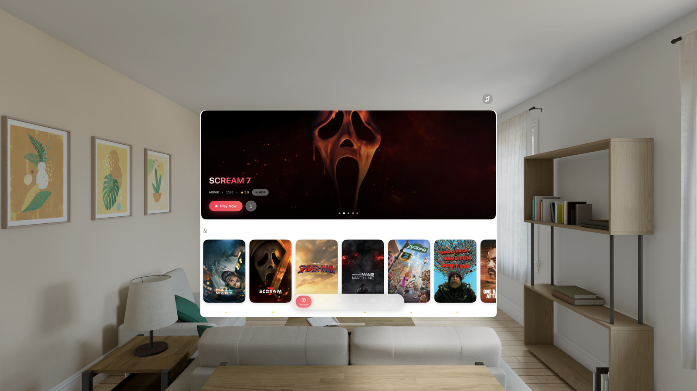
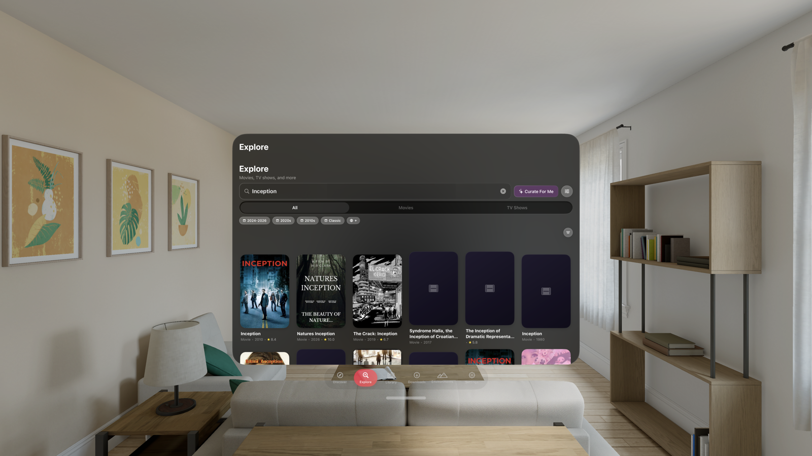
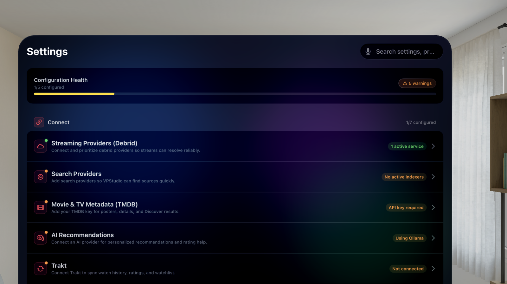
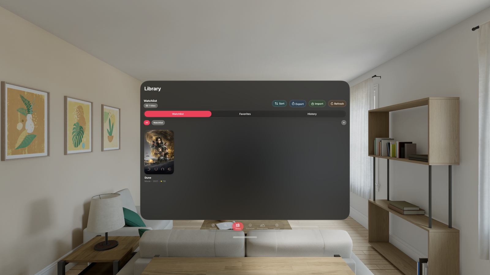

# VPStudio

A visionOS media app for Apple Vision Pro. Browse, search, save, download, and watch content in immersive environments.

Built with Swift, SwiftUI, RealityKit, GRDB, and KSPlayer. Targets visionOS 26+.

---

## What it does

VPStudio handles the full media workflow on Vision Pro: metadata from TMDB, stream resolution through debrid services, codec-aware playback with dual engines (AVPlayer / KSPlayer), subtitle fetching, downloads with real progress tracking, library management with folders and CSV import, and immersive HDRI environments with a head-tracked cinema screen.

It syncs to Trakt, and includes an AI assistant (Anthropic, OpenAI, Gemini, OpenRouter, or Ollama) that generates recommendations from watch history and ratings. Simkl is cleanup-only in this build: settings remain visible for reviewing or clearing saved authorization, but Simkl sync and scrobbling are unavailable.

## How it was built

This project was vibe-coded and shipped through AI-assisted development with a structured prompt workflow, strong test coverage, and iterative cleanup/refactoring.

Architecture and product decisions were reviewed continuously, tested on Vision Pro hardware and simulator, and corrected through repeated bug-fix passes.

With a few known limitations, the app is production-usable. Environment selection is currently unstable; see `docs/ROADMAP_v1.1.md`.

VPStudio follows a BYOK model. Credentials and user data are stored locally and/or with user-selected providers (debrid, indexers, AI services). No user data is stored by the maintainer.

## Features

- **Discover** - Trending, popular, top rated, now playing from TMDB. Hero banner. Continue watching. AI-curated recommendations.
- **Search** - TMDB full-text search with genre/year/rating filters and mood-based AI picks.
- **Library** - Watchlist, favorites, history, downloads. Folder organization. CSV import.
- **Player** - Dual-engine with automatic codec selection. Cinematic transport controls. Lifecycle-safe teardown.
- **Immersive** (Under Construction) - HDRI skybox environments via RealityKit. Head-tracked cinema screen. Custom environment import. (Environment selection remains unstable.)
- **Downloads** - Real byte-level progress via URLSessionDownloadDelegate. Offline playback.
- **Settings** - Debrid providers (RealDebrid, TorBox, AllDebrid, Premiumize, Offcloud, DebridLink, EasyNews), TMDB, Trakt, Simkl cleanup-only surface (sync unavailable in this build), OpenSubtitles, AI providers. Setup wizard. Health dashboard.
- **AI** - Personalized analysis with predicted ratings and verdicts. Taste profile from watch history, ratings, and favorites.

## Release Gallery

### v2

Current release preview:

| Discover | Explore |
| --- | --- |
|  |  |

| Detail | AI Detail |
| --- | --- |
|  |  |

| Discover AI | Settings |
| --- | --- |
|  |  |

| Library |
| --- |
|  |

## Setup

### Requirements

- Apple Silicon Mac
- Xcode 26.1+ with visionOS simulator runtime
- Apple Developer signing team (for physical device)
- Internet for package resolution

### Build

Fastest option for non-technical users:

1. Open the repository on GitHub.
2. Click `Code` -> `Download ZIP`.
3. Unzip, then open `VPStudio.xcodeproj` in Xcode.

If you prefer Git:

1. In GitHub, click `Code` and copy the HTTPS URL.
2. Run:

```bash
git clone https://github.com/BrendanToscano/VPStudio.git
cd VPStudio
open VPStudio.xcodeproj
```

Select `VPStudio` scheme -> `Apple Vision Pro Simulator` (or your device) -> `Cmd+R`.

On first launch you can either:

- `Browse Library` (local sections only until TMDB is configured), or
- `Run Setup` for full configuration.

For full streaming behavior, configure at least a TMDB API key and one debrid provider token. Trakt, AI, and subtitles are optional. Simkl is cleanup-only in this build: settings remain visible for clearing saved authorization, but Simkl sync and scrobbling are unavailable.

### Cost and account notes

- VPStudio setup itself is free.
- TMDB API keys are free for personal/development use.
- Debrid providers are typically paid subscriptions.
- Hosted AI providers (OpenAI/Anthropic) are paid; local Ollama can be run without API billing.
- Trakt sync requires your own account credentials (but mostly free), configured in Settings.
- Simkl is cleanup-only in this build: settings remain visible for credential cleanup, but Simkl sync and scrobbling are unavailable.

### Troubleshooting

- **No simulator:** Install visionOS runtime from Xcode -> Settings -> Components.
- **Package resolution:** Reset caches (`File -> Packages -> Reset Package Caches`), then resolve again.
- **`pkg-config` / `sdl2` warning:** `brew install pkg-config sdl2`, clean (`Shift+Cmd+K`), rebuild.
- **No metadata:** Check TMDB key in Settings.
- **Streaming unavailable:** Save and validate at least one debrid provider.

## Legal use disclaimer

VPStudio is a client application for lawful personal media management and playback.

- It does not host, index, or distribute copyrighted content.
- Users are responsible for how they use third-party services and for complying with local laws and provider terms.
- The project is not affiliated with TMDB, Trakt, Simkl, OpenSubtitles, debrid providers, or indexer operators.

## Project structure

```text
VPStudio/
  App/           -> lifecycle, dependency wiring, root state
  Core/          -> database, keychain, diagnostics, utilities
  Models/        -> domain types
  Services/
    Player/      -> engines, routing, immersive support
    Debrid/      -> debrid service implementations
    AI/          -> assistant manager, providers
    Indexers/    -> torrent indexers
    Metadata/    -> TMDB
    Subtitles/   -> OpenSubtitles
    Sync/        -> Trakt, Simkl service code
  ViewModels/    -> feature state (Detail, Discover, Search, Downloads)
  Views/
    Immersive/   -> RealityKit environments
    Windows/     -> all windowed UI

VPStudioTests/
  Architecture/  -> folder contracts, structural invariants
  Player/        -> lifecycle, teardown, transport tests
  Settings/      -> validation, status tests
  ViewModels/    -> feature behavior tests
  TestSupport/   -> fixtures, stubs
```

Architecture contract tests enforce this layout at build time.

## Docs

- `docs/USER_MANUAL.md` - user-facing manual
- `docs/ROADMAP_v1.1.md` - active roadmap and known limitations

## License

MIT License. See `LICENSE`.
